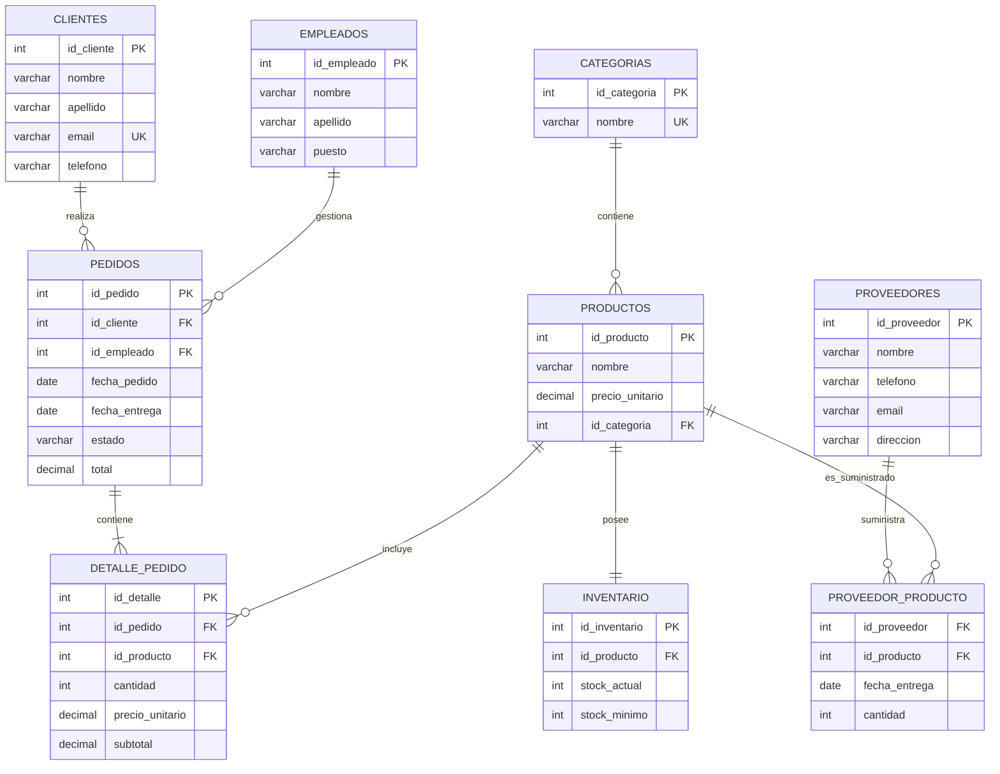

### Modelo mejorado

* **clientes**

  * `id_cliente` — PK
  * `nombre`
  * `apellido`
  * `email` — UNIQUE
  * `telefono`

* **categorias**

  * `id_categoria` — PK
  * `nombre` — UNIQUE

* **productos**

  * `id_producto` — PK
  * `nombre`
  * `precio_unitario`
  * `id_categoria` — FK

* **empleados**

  * `id_empleado` — PK
  * `nombre`
  * `apellido`
  * `puesto`

* **inventario**

  * `id_inventario` — PK
  * `id_producto` — FK
  * `stock_actual`
  * `stock_minimo

* **pedidos**

  * `id_pedido` — PK
  * `id_cliente` — FK
  * `id_empleado` — FK
  * `fecha_pedido`
  * `fecha_entrega`
  * `estado`
  * `total`

* **detalle_pedido**

  * `id_detalle` — PK
  * `id_pedido` — FK
  * `id_producto` — FK
  * `cantidad`
  * `precio_unitario`
  * `subtotal`

* **proveedores**

  * `id_proveedor` — PK
  * `nombre`
  * `telefono`
  * `email`
  * `direccion`

### Mermaid ER



### Relaciones principales

```text
CATEGORIA
    │
    └── 1:N ── PRODUCTO
                   │
                   ├── 1:1 ── INVENTARIO
                   │
                   └── 1:N ── DETALLE_PEDIDO ── N:1 ── PEDIDO
                                                        │
                                                        ├── N:1 ── CLIENTE
                                                        │
                                                        └── N:1 ── EMPLEADO

PROVEEDOR
    │
    └── N:M ── PRODUCTO
          mediante PROVEEDOR_PRODUCTO
```

